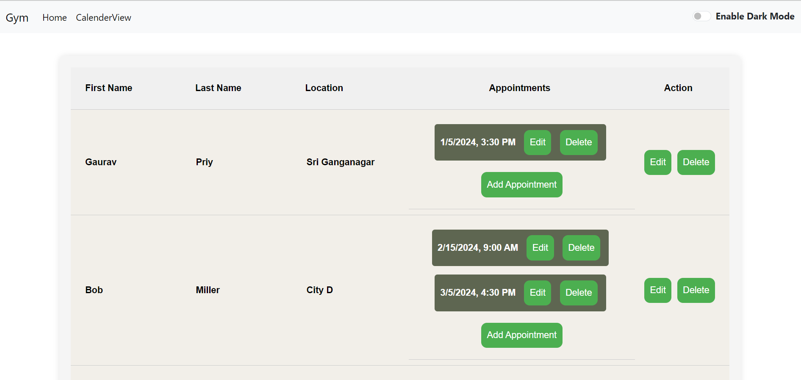

# Fitness Trainer Calendar App

## Overview

The Fitness Trainer Calendar App is a web application designed for fitness trainers to efficiently manage and view their scheduled appointments. This user-friendly calendar allows trainers to keep track of appointments and client information with ease.

## Technology Stack

- **React:** The front-end of the application is built using React, providing a modern and responsive user interface.

## Getting Started

Follow these steps to run the Fitness Trainer Calendar App locally:

1. **Clone the Repository:**
   ```bash
   git clone https://github.com/gaurav452002/fitness_app
   ```

2. **Navigate to the Project Folder:**
   ```bash
   cd fitness-trainer-calendar
   ```

3. **Install Dependencies:**
   ```bash
   npm install
   ```

4. **Start the Development Server:**
   ```bash
   npm start
   ```

This will launch the application locally, and you can access it in your web browser at `http://localhost:3000`.

## Features

### 1. Calendar View

- View all scheduled appointments with a nice interface .
- Each appointment entry displays the client's name for easy reference.

### 2. Appointment Management

- Add new appointments using the appointment modal.
- Edit existing appointments with date and time pickers.
- Delete appointments with a simple click.

### 3. Client Information

- Manage client information using the client modal.
- Edit or delete client details effortlessly.
- Add new clients.

### 4. Dark Mode

- Toggle between light and dark mode for personalized viewing preferences.

## Usage

1. **Show Calendar:**
   - Click the "Show Calendar" button on the initial page to access the calendar view.

2. **Home:**
   - View and manage information of all clients and their scheduled appointments.

3. **Client Information:**
   - Manage client details using the client modal.
   - Under the Action column, use Edit or Delete button to modify client information.

4. **Appointment Information:**
   - Manage all appointents appointment modal.
   - Under the appointment column, find all scheduled appointments along with respective edit and delete button.
   - Add new appointment using the corrosponding button of a client.

5. **Dark Mode:**
   - Toggle dark mode using the switch in the navbar for a personalized viewing experience.

## Screenshots




## Acknowledgements

Special thanks to the creators and contributors of the technologies and libraries used in this project.
